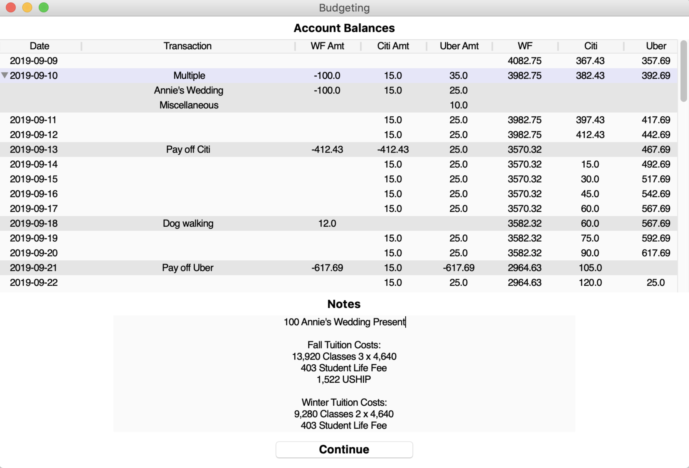

# Budgeting Program
Creating a budget with estimated future expenses and income to practice GUI development.

Used `tkinter` GUI windows in Python that allowed me to:

- See future transactions and budget notes

- Update current account balances

- Add transactions

- Pay off credit cards in full

