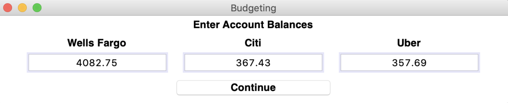

# Budgeting Program
Creating a budget with estimated future expenses and income to practice GUI development.

Used `tkinter` GUI windows in Python that allowed me to:
- See future transactions and budget notes    
- Update current account balances    
- Add transactions    
- Pay off credit cards in full   

